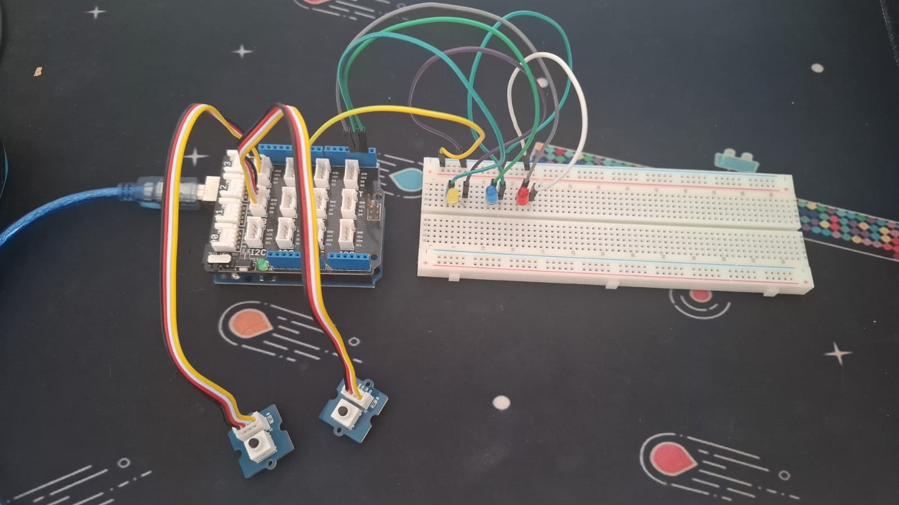
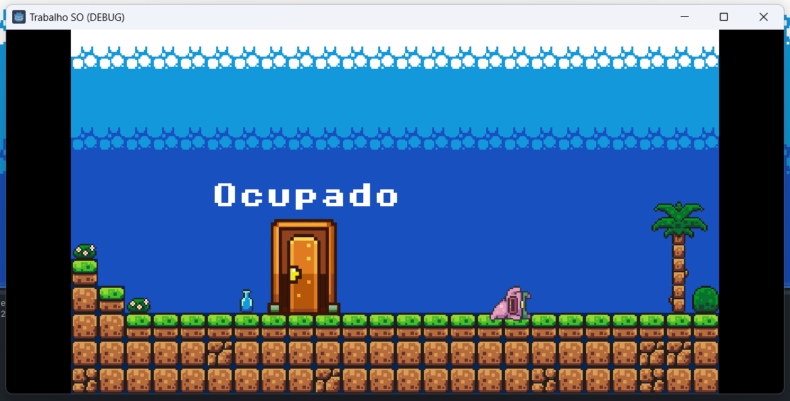

# Exclusão Mútua Com espera ocupada exemplificação:

Neste projeto, implementamos um sistema para controlar um LED utilizando dois botões físicos conectados a um Arduino. O objetivo principal foi garantir que apenas um botão podesse acessar o recurso (o LED) por vez, implementando assim o conceito de exclusão mútua. Essa abordagem é fundamental em sistemas concorrentes, onde múltiplas tarefas ou componentes disputam o uso de um recurso compartilhado.

<p align="center"></p>

Foi feito um projeto na Godot na qual é feita a leitura na porta Serial. E de acordo com os dados enviados pelo arduino ações são realizadas dentro da Godot.

Mensagens enviadas pelo Arduíno: 
```
BTN1-L; // Botão 1 Bloqueou o Recurso
BTN1-U; // Botão 1 Desbloqueou o Recurso
BTN1-B; // Recurso Bloqueado
BTN2-L; // Botão 2 Bloqueou o Recurso
BTN2-U; // Botão 2 Desbloqueou o Recurso
BTN2-B; // Recurso Bloqueado
```

<p align="center"></p>

## Video Demonstrativo


https://github.com/user-attachments/assets/c2fef152-5f60-46ae-8b9a-83b8f45f6fdd


## Ferramentas Ultilizadas

- VScode
- Godot 4.3
- Arduíno UNO
- Protoboard
- Base Shield V2
- 1 LED vermelho
- 2 botões


## Componentes

- Ennoile Raquel
- Heloíse Vitória
- Kayth Kariny   
- Nathalya Christinne
